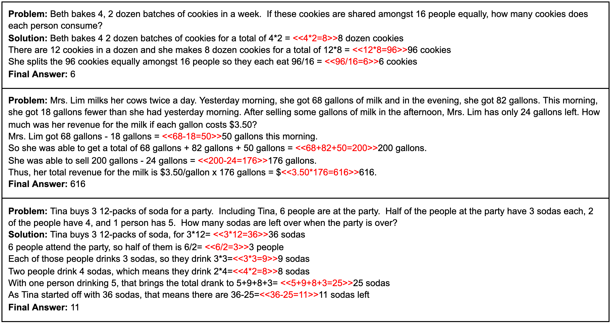

**Status**: Archive (code is provided as-is, no updates expected)

# Grade School Math

#### [[Blog Post]](https://openai.com/blog/grade-school-math/) [[Paper]](https://arxiv.org/abs/2110.14168)

State-of-the-art language models can match human performance on many tasks, but they still struggle to robustly perform multi-step mathematical reasoning. To diagnose the failures of current models and support research, we're releasing GSM8K, a dataset of 8.5K high quality linguistically diverse grade school math word problems. We find that even the largest transformer models fail to achieve high test performance, despite the conceptual simplicity of this problem distribution.

<p align="center">
    
</p>

## Dataset Details

GSM8K consists of 8.5K high quality grade school math problems created by human problem writers. We segmented these into 7.5K training problems and 1K test problems. These problems take between 2 and 8 steps to solve, and solutions primarily involve performing a sequence of elementary calculations using basic arithmetic operations (+ - / \*) to reach the final answer. A bright middle school student should be able to solve every problem.

The raw data files can be found in:

- `grade_school_math/data/train.jsonl`
- `grade_school_math/data/test.jsonl`

Each line of those files corresponds to a single grade school math problem, saved as a json dictionary (with a "question" key and an "answer" key). The answer is formatted such that it uses calculation annotations and so that the final numeric solution is the final line of the solution, preceded by `####`.

### Calculation Annotations

Our models frequently fail to accurately perform calculations. Although larger models make fewer arithmetic mistakes than smaller models, this remains a common source of errors. To mitigate this issue, we train our models to use a calculator by injecting calculation annotations into the training set. At training time, we simply finetune on this language data as is. At test time, a calculator will override sampling when the model chooses to use these annotations. An example implementation of the calculator sampling can be found in `calculator.py`.

If you would like to remove the calculator annotations, simply remove any string that starts with `<<` and ends with `>>`.

### Solution Extracting

To extract the final numeric solution for a particular question, simply parse the completion to extract the numeric value immediately following the `####` token. Some example python code to do so is shown in `dataset.py:is_correct`.

### Socratic Dataset

During our research, we also investigated a modified solution format that injects automatically generated "Socratic subquestions" before each step. Although we ultimately did not use this format for any experiments in the paper, we make this data available to anyone who is interested.

We show an example below, with the socratic subquestions in bold:

<pre>
A carnival snack booth made $50 selling popcorn each day. It made three times as much selling cotton candy. For a 5-day activity, the booth has to pay $30 rent and $75 for the cost of the ingredients. How much did the booth earn for 5 days after paying the rent and the cost of ingredients?
<b>How much did the booth make selling cotton candy each day? **</b> The booth made $50 x 3 = $<<50*3=150>>150 selling cotton candy each day.
<b>How much did the booth make in a day? **</b> In a day, the booth made a total of $150 + $50 = $<<150+50=200>>200.
<b>How much did the booth make in 5 days? **</b> In 5 days, they made a total of $200 x 5 = $<<200*5=1000>>1000.
<b>How much did the booth have to pay? **</b> The booth has to pay a total of $30 + $75 = $<<30+75=105>>105.
<b>How much did the booth earn after paying the rent and the cost of ingredients? **</b> Thus, the booth earned $1000 - $105 = $<<1000-105=895>>895.
</pre>

We generated each Socratic subquestion by conditioning on each ground truth (contractor-provided) step in a solution, using a model specifically finetuned for this task (on around 800 examples). To construct the full Socratic dataset, each step in the solution was prefixed by the model-generated Socratic subquestion. Steps were otherwise left untouched.

These data files can be found in:

- `grade_school_math/data/train_socratic.jsonl`
- `grade_school_math/data/test_socratic.jsonl`

## View Model Solutions

For each test question, we provide solutions generated from 6B finetuning, 6B verification, 175B finetuning and 175B verification. This data can be found in:

- `grade_school_math/data/example_model_solutions.jsonl`

To view these results problem-by-problem, run:

```bash
python view_model_solutions.py
```

Note: These model-generated samples used a slightly older version of the calculator. Previous implementation bugs led to calculator failures in roughly 1% of model samples. Those issues have been fixed in the codebase, but since the samples have not been regenerated, occasional calculation errors are present.

## Citation

Please use the below BibTeX entry to cite this dataset:

```
@article{cobbe2021gsm8k,
  title={Training Verifiers to Solve Math Word Problems},
  author={Cobbe, Karl and Kosaraju, Vineet and Bavarian, Mohammad and Chen, Mark and Jun, Heewoo and Kaiser, Lukasz and Plappert, Matthias and Tworek, Jerry and Hilton, Jacob and Nakano, Reiichiro and Hesse, Christopher and Schulman, John},
  journal={arXiv preprint arXiv:2110.14168},
  year={2021}
}
```

# Usage

We present a basic example of training a GPT2 sized model and using the calculator in the sampling process. We include this code for illustrative purposes only. This pipeline was not used for any experiments in the paper.

**Training a Model**

```bash
python train.py
```

**Sampling from the Model**

```bash
python sample.py
```

The core calculator sampling logic can be found in `calculator.py:sample`. Note that this code is inefficient as implemented. Specifically, the function does not support batches, and does not cache activations from previous tokens.
